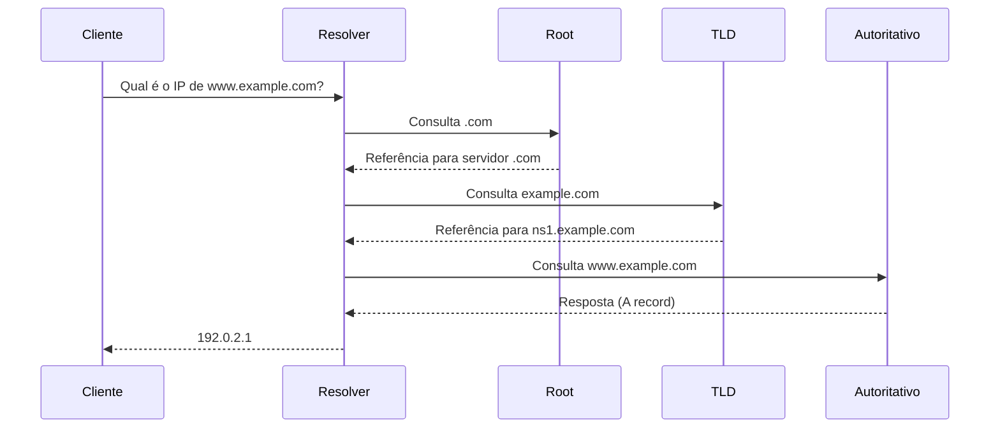

# Arquitetura Cliente-Servidor para Web

## Visão Geral
Modelo onde:
- **Cliente** (navegador, app) solicita recursos.
- **Servidor** (back-end) processa e responde.

---

## Protocolo HTTP/HTTPS
### O que é?
- **HTTP** (*HyperText Transfer Protocol*): Protocolo para transferência de dados na web.
- **HTTPS** (*HTTP Secure*): Versão criptografada (usando SSL/TLS).

### Características:
- **Stateless**: Cada requisição é independente (sessões usam cookies/JWT).
- **Métodos**:
  - `GET`: Solicita dados (ex: carregar página).
  - `POST`: Envia dados (ex: formulário).
  - `PUT/PATCH`: Atualiza recursos.
  - `DELETE`: Remove recursos.
- **Códigos de Status**:
  - `200 OK`: Sucesso.
  - `404 Not Found`: Recurso inexistente.
  - `500 Internal Server Error`: Falha no servidor.

### Exemplo de Requisição:
```http
GET /index.html HTTP/1.1
Host: www.exemplo.com
User-Agent: Mozilla/5.0
```
###Link de Apoio: [https://developer.mozilla.org/pt-BR/docs/Web/HTTP(mdn web docs_)]
---
# TCP/IP, Endereçamento IP e DNS

## TCP/IP - Pilha de Protocolos

### TCP (Transmission Control Protocol)
- **Conexão confiável**: Confirmação de recebimento de pacotes
- **Ordenação de pacotes**: Garante que os dados cheguem na ordem correta
- **Controle de fluxo**: Evita sobrecarga do receptor

### IP (Internet Protocol)
- **Endereçamento lógico**: Ex: `192.168.1.1`
- **Roteamento de pacotes**: Encaminhamento entre redes
- **Fragmentação**: Divide pacotes grandes quando necessário

### Portas Bem Conhecidas
| Porta | Serviço  | Protocolo |
|-------|----------|-----------|
| 80    | HTTP     | TCP       |
| 443   | HTTPS    | TCP       |
| 53    | DNS      | UDP/TCP   |
| 22    | SSH      | TCP       |
| 25    | SMTP     | TCP       |

## Endereçamento IP

### Tipos de Endereços
- **IPv4**
  - 32 bits (ex: `192.168.0.1`)
  - Notação decimal: 4 octetos (0-255)
  - Esgotado desde 2011

- **IPv6**
  - 128 bits (ex: `2001:0db8:85a3::8a2e:0370:7334`)
  - Notação hexadecimal
  - Solução para escassez de endereços

### Classes IPv4
| Classe | Faixa             | Máscara Padrão | Uso                     |
|--------|-------------------|----------------|-------------------------|
| A      | 1.0.0.0-126.255.255.255 | 255.0.0.0      | Grandes redes           |
| B      | 128.0.0.0-191.255.255.255 | 255.255.0.0    | Redes médias            |
| C      | 192.0.0.0-223.255.255.255 | 255.255.255.0  | Pequenas redes          |
| D      | 224.0.0.0-239.255.255.255 | -              | Multicast               |
| E      | 240.0.0.0-255.255.255.255 | -              | Experimental            |

## Sistema de Nomes de Domínio (DNS)

### Hierarquia DNS
1. **Root DNS** (.)
2. **Top-Level Domains (TLD)**
   - genéricos (.com, .org)
   - country-code (.br, .us)
3. **Domínios de Segundo Nível** (ex: google.com)
4. **Subdomínios** (ex: mail.google.com)

### Tipos de Registros DNS
| Tipo   | Função                          | Exemplo                     |
|--------|---------------------------------|-----------------------------|
| A      | Mapeia hostname → IPv4          | example.com → 192.0.2.1     |
| AAAA   | Mapeia hostname → IPv6          | example.com → 2001:db8::1   |
| CNAME  | Cria um alias                   | www → example.com           |
| MX     | Servidores de email             | 10 mail.example.com         |
| TXT    | Texto arbitrário (SPF, DKIM)    | "v=spf1 include:_spf.google.com ~all" |
| NS     | Nameservers autoritativos       | ns1.example.com             |

### Processo de Resolução DNS

---
# HTTP Response: Structure and Status Codes

## Basic Structure
An HTTP response contains three main parts:

```http
HTTP/1.1 200 OK
Content-Type: text/html
Content-Length: 127

<html>
  <body># Resposta HTTP
```

Uma **resposta HTTP** é a mensagem enviada por um servidor web em resposta a uma requisição feita por um cliente (geralmente um navegador). Essa resposta contém informações sobre o resultado da requisição, os dados solicitados (caso aplicável) e metadados adicionais.

## Estrutura de uma Resposta HTTP

Uma resposta HTTP é composta por três partes principais:

1. **Linha de status (Status Line)**
2. **Cabeçalhos de resposta (Response Headers)**
3. **Corpo da resposta (Response Body)**

### 1. Linha de Status

A primeira linha da resposta HTTP informa o **código de status** da requisição e a **mensagem de status**. Exemplo:


    <h1>Hello World!</h1>
  </body>
</html>

1. Linha de Status

    Versão do Protocolo: HTTP/1.1

    Código de Status: 200

    Mensagem de Status: OK

- `HTTP/1.1`: Versão do protocolo HTTP
- `200`: Código de status
- `OK`: Texto descritivo do status

### 2. Cabeçalhos de Resposta

Os cabeçalhos fornecem informações adicionais sobre a resposta. Exemplo:

Content-Type: text/html; charset=UTF-8
Content-Length: 3056
Cache-Control: no-cache

Esses cabeçalhos ajudam o cliente a entender como processar o corpo da resposta.

### 3. Corpo da Resposta

O corpo (body) contém os dados solicitados, como HTML, JSON, imagens, arquivos etc. Nem toda resposta possui um corpo (por exemplo, respostas `204 No Content`).

## Códigos de Status HTTP

Os códigos de status são agrupados em cinco classes:

| Classe | Descrição                            | Exemplos               |
|--------|----------------------------------------|------------------------|
| 1xx    | Informativo                          | 100 Continue           |
| 2xx    | Sucesso                              | 200 OK, 201 Created    |
| 3xx    | Redirecionamento                     | 301 Moved Permanently  |
| 4xx    | Erro do Cliente                      | 400 Bad Request, 404 Not Found |
| 5xx    | Erro do Servidor                     | 500 Internal Server Error |

## Exemplo de Resposta HTTP Completa

HTTP/1.1 200 OK
Date: Tue, 05 Aug 2025 14:00:00 GMT
Content-Type: text/html; charset=UTF-8
Content-Length: 137
<html> <head><title>Exemplo</title></head> <body><p>Resposta de exemplo.</p></body> </html> ```

-Conclusão

Respostas HTTP são fundamentais na comunicação entre clientes e servidores na web. Elas indicam o status da requisição e, quando aplicável, retornam dados úteis para o cliente.
